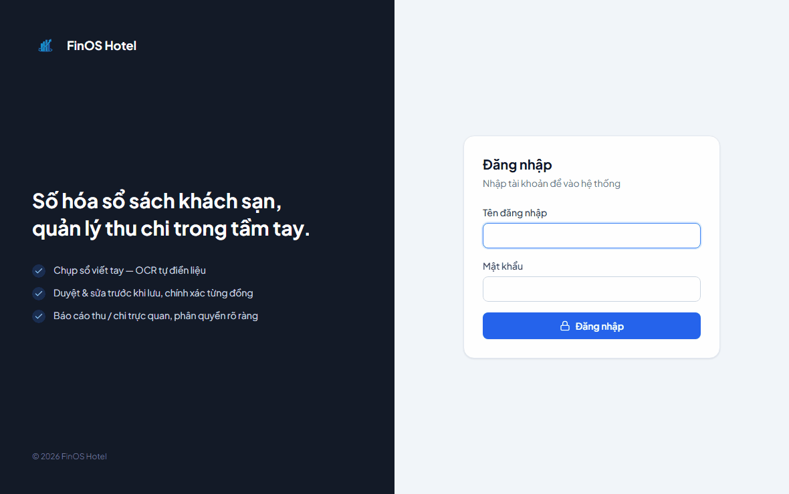
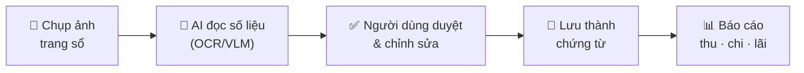
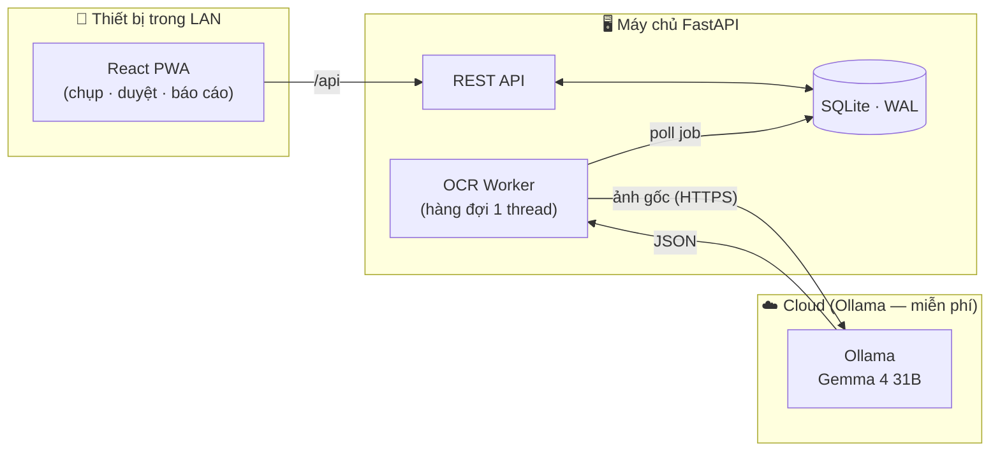

<p align="center">
  
</p>

<h1 align="center">FinOS Hotel</h1>

<p align="center">
  <em>Số hóa sổ thu–chi viết tay của khách sạn bằng AI — chụp ảnh, OCR đọc số liệu, con người duyệt, lưu thành chứng từ kế toán.</em>
</p>

<p align="center">
  <a href="#-tính-năng-chính">Tính năng</a> ·
  <a href="#-luồng-hoạt-động">Workflow</a> ·
  <a href="#-kiến-trúc">Kiến trúc</a> ·
  <a href="#-chạy-với-docker">Cài đặt</a> ·
  <a href="#-công-nghệ">Công nghệ</a> ·
  <a href="#-hạn-chế-hiện-biết">Hạn chế</a> ·
  <a href="#-liên-hệ">Liên hệ</a>
</p>

<p align="center">
  
  
  
  
  
  
</p>


## 🎬 Demo



> 📺 [Xem bản video WebM chất lượng cao hơn](docs/demo/finos-hotel-demo.webm)


## 📖 Giới thiệu

**FinOS Hotel** là ứng dụng nội bộ giúp khách sạn số hóa sổ thu–chi viết tay. Thay vì gõ lại từng dòng từ sổ giấy, nhân viên chỉ cần **chụp ảnh trang sổ**; hệ thống dùng mô hình thị giác (VLM) để đọc dữ liệu, rồi người dùng **kiểm tra, chỉnh sửa và xác nhận** trước khi lưu thành chứng từ kế toán.

Dự án được thiết kế để **self-host bằng Docker** trong LAN hoặc VPS. Phần OCR nặng (Ollama) chạy trên cloud **miễn phí** — không cần GPU hay đầu tư phần cứng riêng.

> ### 🔒 Nguyên tắc bất biến
> **OCR chỉ *điền sẵn* biểu mẫu — không bao giờ tự ghi thẳng vào sổ kế toán.**
> Chữ viết tay không đủ tin cậy. Pipeline trả về *các dòng đề xuất* kèm độ tin cậy từng trường; bảng `transactions` **chỉ chứa dữ liệu đã được con người phê duyệt**.


## ✨ Tính năng chính

| | Tính năng | Mô tả |
|---|---|---|
| 📸 | **Chụp & tải ảnh** | Mở camera điện thoại hoặc chọn ảnh có sẵn; xoay ảnh trước khi OCR. |
| 🤖 | **OCR sổ viết tay** | Mô hình thị giác Gemma 4 31B đọc nguyên trang sổ, kể cả số tiền khoanh tròn. |
| ✅ | **Duyệt song song ảnh gốc** | So sánh ảnh thật với từng dòng được đọc; sửa ngày, phòng, nội dung, số tiền. |
| 🔄 | **OCR lại** | Chạy lại với góc xoay khác khi ảnh nghiêng/đọc thiếu dòng. |
| 📚 | **Thư viện upload** | Xem lại lịch sử ảnh đã OCR, trạng thái job, chạy lại hoặc xóa. |
| 📊 | **Dashboard & báo cáo** | Tổng thu, tổng chi, chênh lệch; biểu đồ theo ngày/tháng. |
| 👥 | **Phân quyền (RBAC)** | 3 vai trò `admin` / `accountant` / `receptionist`, gác ở cả API lẫn UI. |
| 🧾 | **Nhật ký hoạt động** | Theo dõi thao tác quan trọng trong hệ thống (admin). |
| 📱 | **PWA cài đặt được** | Dùng như app trên điện thoại, hỗ trợ chụp ảnh trực tiếp. |


## 🔄 Luồng hoạt động

Từ trang sổ giấy đến chứng từ kế toán chỉ qua 4 bước — và **con người luôn là chốt chặn cuối**:



1. **Chụp** — nhân viên chụp hoặc tải ảnh trang sổ từ điện thoại/máy tính.
2. **Đọc** — mô hình thị giác đọc cả trang, tách thành các dòng giao dịch *đề xuất* kèm độ tin cậy.
3. **Duyệt** — người dùng xem ảnh gốc song song với kết quả, sửa ngày/phòng/nội dung/số tiền, thêm hoặc bớt dòng. Ảnh nghiêng có thể OCR lại với góc xoay khác.
4. **Lưu & báo cáo** — chỉ dòng đã duyệt mới trở thành chứng từ chính thức; dashboard & báo cáo lấy số liệu từ đây.

> 🔒 **AI chỉ điền sẵn — không tự ghi sổ.** Chữ viết tay không đủ tin cậy, nên bước duyệt của con người là bắt buộc.


## 🏗 Kiến trúc

**Một tiến trình FastAPI duy nhất, không dịch vụ ngoài** — không Redis/Celery/Postgres, hàng đợi job chính là một bảng SQLite. Toàn bộ chạy offline trong mạng LAN.



- **Backend siêu nhẹ** — chỉ gọi HTTP + xử lý ảnh bằng Pillow, không torch/onnx/opencv. OCR nặng được tách hoàn toàn ra Ollama chạy trên cloud (miễn phí).
- **Vì sao dùng VLM?** Sổ viết tay có tổng tiền *khoanh tròn* — OCR cổ điển bỏ sót cả cột số tiền; mô hình thị giác đọc cả trang một cách toàn cục.
- **Concurrency cố tình bằng 1** — không bao giờ xử lý hai ảnh cùng lúc, tránh quá tải.


## 🐳 Chạy với Docker

> Đây là cách triển khai được khuyến nghị — một lệnh dựng cả API lẫn UI.

**Yêu cầu:** Docker + Docker Compose đã cài, và một instance Ollama đang chạy (trên cloud hoặc máy local).

```bash
# 0. Chuẩn bị model OCR mặc định trên máy Ollama
ollama pull gemma4:31b-cloud

# 1. Sao chép file cấu hình
cp .env.example .env

# 2. Mở .env, đổi hai giá trị bắt buộc:
#    FINOS_SECRET_KEY   — chuỗi ngẫu nhiên, giữ bí mật
#    FINOS_ADMIN_PASSWORD — mật khẩu tài khoản admin
#    FINOS_OLLAMA_HOST  — địa chỉ Ollama (ví dụ: https://your-ollama.cloud)
#    FINOS_OCR_MODEL    — mặc định gemma4:31b-cloud

# 3. Build và chạy
docker compose up -d --build
```

Sau khi khởi động, truy cập **`http://localhost:8000`** (hoặc IP máy chủ nếu dùng trong LAN).

> Dữ liệu (DB + ảnh upload) được lưu vào Docker volume `finos_data` — bền vững qua các lần rebuild.


## 🧰 Công nghệ

| Lớp | Công nghệ |
|---|---|
| **Frontend** | React 18 · Vite 5 · TypeScript · Tailwind CSS · React Router · Recharts · PWA |
| **Backend** | FastAPI · Pydantic v2 · Uvicorn · Pillow |
| **Auth** | JWT (HS256, PyJWT) · Argon2 (argon2-cffi) |
| **Database** | SQLite (WAL mode, `busy_timeout=30s`) — tiền lưu dạng số nguyên VND |
| **OCR / AI** | Ollama + Gemma 4 31B (vision, `format:"json"`, `temperature:0`) — chạy trên cloud miễn phí |
| **Đóng gói** | Docker — một image phục vụ cả API và UI từ cổng 8000 |


## ⚠️ Hạn chế hiện biết

- OCR phụ thuộc chất lượng ảnh, góc xoay, nét chữ và model VLM đang chạy; mọi dòng OCR phải được người dùng duyệt lại trước khi lưu.
- Hàng đợi OCR cố tình chạy concurrency = 1 để tránh quá tải model; hệ thống không tối ưu cho nhiều khách sạn hoặc nhiều ca OCR song song. (nếu có nhu cầu số hóa lớn hơn liên hệ với tôi)
- SQLite phù hợp triển khai nhỏ trong LAN/VPS đơn lẻ; nếu cần đa chi nhánh, nhiều máy ghi đồng thời hoặc HA thì nên thiết kế lại tầng dữ liệu.
- Ứng dụng chưa thay thế quy trình kế toán chính thức; cần đối soát chứng từ gốc và tuân thủ quy định lưu trữ dữ liệu tại nơi triển khai.
- PWA/camera hoạt động tốt nhất trên `localhost` hoặc HTTPS. Khi dùng qua LAN bằng IP nội bộ, một số trình duyệt có thể hạn chế quyền camera/thông báo.


## 👥 Vai trò & phân quyền

| Vai trò | Quyền |
|---|---|
| `admin` | Toàn quyền · quản lý người dùng · báo cáo · nhật ký hoạt động · xóa dữ liệu. |
| `accountant` | Nhập / duyệt / sửa chứng từ · xóa mềm · xem báo cáo. |
| `receptionist` (lễ tân) | Chụp & OCR · tạo/xem/sửa chứng từ (không xóa) · dashboard chỉ tổng trong ngày · chỉ thấy job OCR của mình. |

> 🚀 Dự án được đóng gói bằng **Docker** — triển khai trong LAN hoặc VPS, OCR chạy miễn phí trên cloud.


## 📬 Liên hệ

README này chỉ giới thiệu tổng quan về dự án. **Nếu bạn quan tâm** đến chi tiết kỹ thuật, hướng dẫn cài đặt/triển khai, hay muốn dùng thử — cứ nhắn cho mình nhé:

- 📧 **Email:** namtran34311@gmail.com


## 📄 Giấy phép

Phát hành theo giấy phép [MIT](LICENSE).

<p align="center"><sub>Made with ☕ for small hotels · self-hosted · cloud OCR miễn phí</sub></p>
