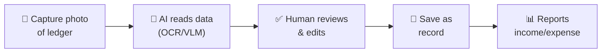
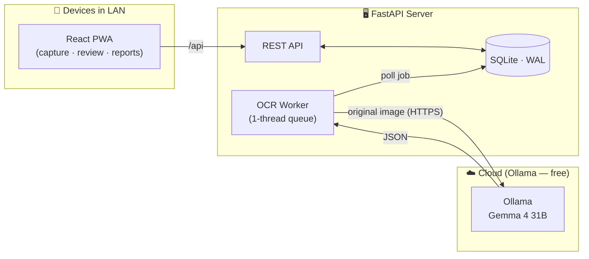

<p align="center">
  
</p>

<h1 align="center">FinOS Hotel</h1>

<p align="center">
  <em>Digitizing handwritten hotel ledgers with AI — photo capture, OCR extraction, human review, and save as accounting records.</em>
</p>

<p align="center">
  <a href="#-features">Features</a> ·
  <a href="#-workflow">Workflow</a> ·
  <a href="#-architecture">Architecture</a> ·
  <a href="#-docker-installation">Installation</a> ·
  <a href="#-technology-stack">Tech Stack</a> ·
  <a href="#-known-limitations">Limitations</a> ·
  <a href="#-contact">Contact</a>
</p>

<p align="center">
  
  
  
  
  
  
</p>


## 🎬 Demo


> ▶️ [View interactive demo on Arcade](https://demo.arcade.software/U6tJGPlmO47885VT3Ya4)


## 📖 Introduction

**FinOS Hotel** is an internal application that helps hotels digitize handwritten income/expense ledgers. Instead of retyping every line from paper, staff only need to **take a photo of the ledger page**; the system uses a Vision Language Model (VLM) to read the data, and then users **check, edit, and approve** before saving it as an accounting record.

The project is designed to be **self-hosted with Docker** in a LAN or VPS. The heavy OCR component (Ollama) runs on the cloud **for free** — no GPU or dedicated hardware investment required.

> ### 🔒 Core Principle
> **OCR only *pre-fills* the form — it never writes directly to the accounting ledger.**
> Handwriting is not reliable enough. The pipeline returns *suggested rows* with per-field confidence; the `transactions` table **only holds human-approved data**.


## ✨ Features

| | Feature | Description |
|---|---|---|
| 📸 | **Capture & Upload** | Open phone camera or select existing photos; rotate images before OCR. |
| 🤖 | **Handwriting OCR** | Gemma 4 31B vision model reads the whole page, including circled amounts. |
| ✅ | **Side-by-side Review** | Compare the original photo with read rows; edit date, room, note, amount. |
| 🔄 | **Re-OCR** | Re-run with a different rotation angle for skewed images/missed rows. |
| 📚 | **Upload Library** | Review OCR history, job status, retry, or delete. |
| 📊 | **Dashboard & Reports** | Total income, expense, balance; daily/monthly charts. |
| 👥 | **Role-Based Access (RBAC)** | 3 roles: `admin` / `accountant` / `receptionist`, guarded at both API & UI levels. |
| 🧾 | **Activity Log** | Track important operations in the system (admin). |
| 📱 | **Installable PWA** | Use like a native app on mobile, supports direct camera capture. |

<br/>

## 🚀 Changelog

<details>
<summary><b>v1.1.0 (Latest Release)</b></summary>

- **[Major Feature] Automated Monthly Reports:** Support creating, managing, and automatically summarizing monthly income/expense data into professional Excel files.
- **[Mobile UI/UX Optimization]** Improved mobile interface: Optimized navigation bar and consolidated the Reports feature into the Profile section for Admin/Accountant for easier access.
- Updated and expanded the API system to better support the OCR workflow and transaction management.

</details>

<details>
<summary><b>v1.0.0 (Initial Release)</b></summary>

- Launched AI-powered internal hotel ledger digitization system (Gemma 4).
- Core features: photo capture, OCR extraction, human review, and 3-level RBAC.

</details>


## 🔄 Workflow

From paper ledger to accounting records in just 4 steps — and **a human is always the final gatekeeper**:



1. **Capture** — Staff capture or upload a ledger photo from a phone/computer.
2. **Read** — Vision model reads the entire page, extracting *suggested* transaction rows with confidence scores.
3. **Review** — User views the original photo side-by-side with results, edits date/room/note/amount, adds or removes rows. Skewed photos can be re-OCRed with a different rotation.
4. **Save & Report** — Only approved rows become official records; dashboard & reports pull data from here.

> 🔒 **AI only pre-fills — it does not auto-record.** Handwriting is not reliable enough, so human review is mandatory.


## 🏗 Architecture

**A single FastAPI process, no external services** — no Redis/Celery/Postgres, the job queue is a SQLite table. Everything runs offline in the LAN.



- **Ultra-lightweight Backend** — Only handles HTTP + image processing via Pillow, no torch/onnx/opencv. Heavy OCR is entirely offloaded to Ollama running on the cloud (free).
- **Why VLM?** Handwritten ledgers often have circled total amounts; classic OCR misses the entire amount column. Vision models read the whole page holistically.
- **Concurrency strictly set to 1** — Never process two images simultaneously to prevent overloading.


## 🐳 Docker Installation

> This is the recommended deployment method — one command sets up both API and UI.

**Requirements:** Docker + Docker Compose installed, and a running Ollama instance (cloud or local).

```bash
# 0. Prepare the default OCR model on your Ollama machine
ollama pull gemma4:31b-cloud

# 1. Copy the configuration file
cp .env.example .env

# 2. Open .env, change the two required values:
#    FINOS_SECRET_KEY   — random string, keep secret
#    FINOS_ADMIN_PASSWORD — admin account password
#    FINOS_OLLAMA_HOST  — Ollama address (e.g., https://your-ollama.cloud)
#    FINOS_OCR_MODEL    — default is gemma4:31b-cloud

# 3. Build and run
docker compose up -d --build
```

After startup, access **`http://localhost:8000`** (or server IP if used within LAN).

> Data (DB + uploaded images) is saved to Docker volume `finos_data` — persistent across rebuilds.


## 🧰 Technology Stack

| Layer | Technology |
|---|---|
| **Frontend** | React 18 · Vite 5 · TypeScript · Tailwind CSS · React Router · Recharts · PWA |
| **Backend** | FastAPI · Pydantic v2 · Uvicorn · Pillow |
| **Auth** | JWT (HS256, PyJWT) · Argon2 (argon2-cffi) |
| **Database** | SQLite (WAL mode, `busy_timeout=30s`) — money stored as VND integers |
| **OCR / AI** | Ollama + Gemma 4 31B (vision, `format:"json"`, `temperature:0`) — runs free on cloud |
| **Deployment** | Docker — a single image serves both API and UI on port 8000 |


## ⚠️ Known Limitations

- OCR depends on image quality, rotation angle, handwriting, and the active VLM model; all OCR rows must be reviewed by the user before saving.
- The OCR queue intentionally runs with concurrency = 1 to avoid model overload; the system is not optimized for multiple hotels or many parallel OCR sessions. (Contact me if you need larger scale digitization).
- SQLite is suitable for small LAN/VPS deployments; if you need multiple branches, concurrent heavy writes, or HA, the data layer should be redesigned.
- The app does not replace official accounting procedures; original receipts must be verified and local data retention regulations followed.
- PWA/camera works best on `localhost` or HTTPS. When using LAN IP, some browsers may restrict camera/notification permissions.


## 👥 Roles & Permissions

| Role | Permissions |
|---|---|
| `admin` | Full access · manage users · reports · activity log · delete data. |
| `accountant` | Enter / approve / edit records · soft delete · view reports. |
| `receptionist` | Capture & OCR · create/view/edit records (no delete) · dashboard limited to daily total · can only see own OCR jobs. |

> 🚀 The project is packaged using **Docker** — deploy in LAN or VPS, OCR runs free on the cloud.


## 📬 Contact

This README only provides an overview of the project. **If you are interested** in technical details, installation/deployment instructions, or want to try it out — feel free to reach out:

- 📧 **Email:** namtran34311@gmail.com


## 📄 License

Released under the [MIT](LICENSE) license.

<p align="center"><sub>Made with ☕ for small hotels · self-hosted · free cloud OCR</sub></p>
